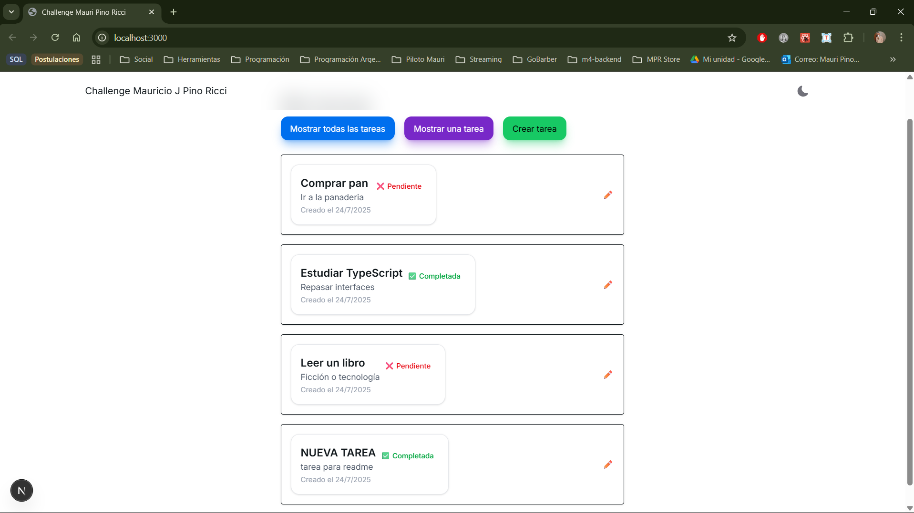
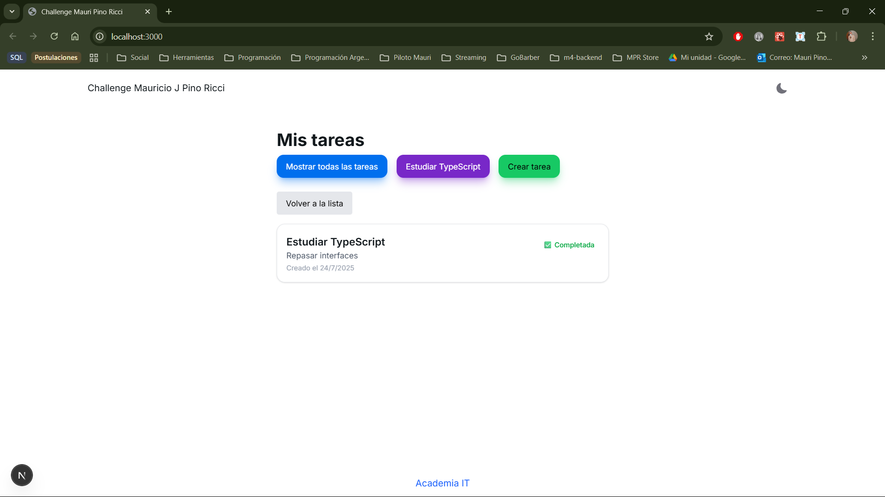
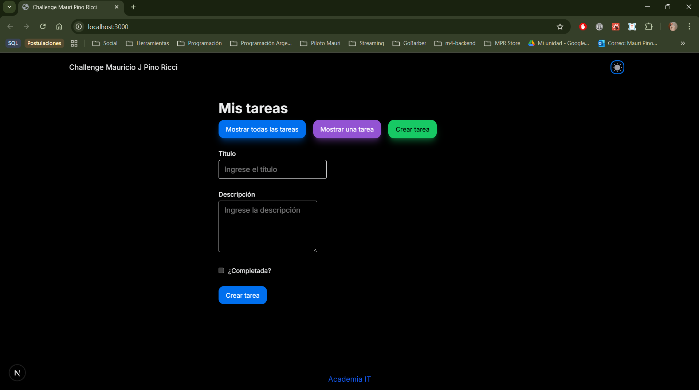

Título del Proyecto:
    
    - Lista de Tareas

Descripción:

    - "Esta es una aplicación básica de lista de tareas que permite a los usuarios crear, leer, actualizar y eliminar tareas."

Tecnologías Utilizadas:

    - Backend: Node.js, Express
    - Frontend: HeroUI, Nextjs
    - Almacenamiento: Array en memoria
    - Estilos: TailwindCSS

Requisitos Previos:

    - Herramientas necesarias para ejecutar el proyecto.
    - Node.js
    - npm 
    - Git

Instalación:

    1.Clonar el Repositorio:

        - git clone https://github.com/MauriPinoRicci/ForIT

    2.Instalar Dependencias:

        - cd backend
        - npm install  

        - cd frontend
        - npm install

    3.Ejecutar la Aplicación:

        - cd backend
        - npm start   

        - cd frontend
        - npm run dev

Uso:

    - Acceder a la aplicación en el navegador en http://localhost:3000 (o el puerto que uses).

Endpoints de la API:

    - GET /api/tasks: Obtener todas las tareas.
    - POST /api/tasks: Crear una nueva tarea.
    - PUT /api/tasks/:id: Actualizar una tarea existente.
    - DELETE /api/tasks/:id: Eliminar una tarea.

Capturas de Pantalla:

    - Imágenes de la aplicación en funcionamiento.

    
    
    

    